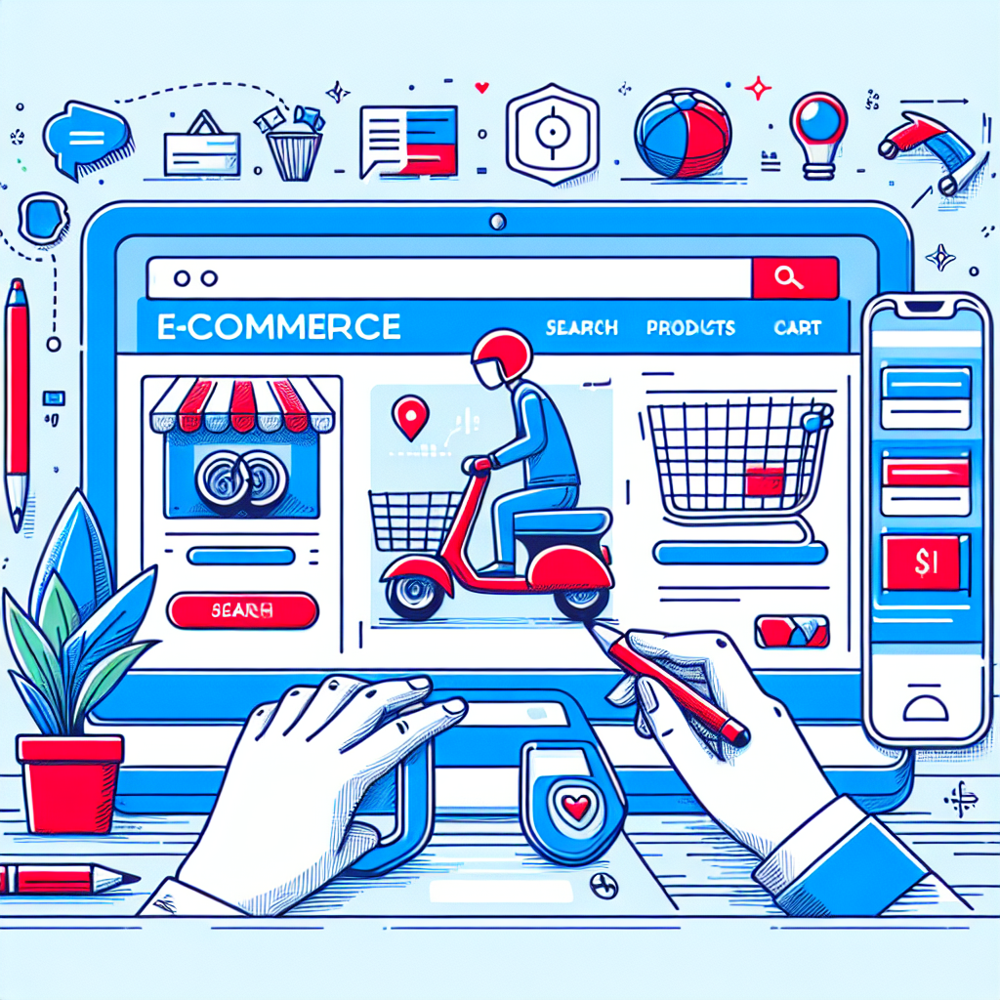

# Arcade Flow Analysis Report

**Flow Name:** Add a Scooter to Your Cart on Target.com
**Generated:** November 09, 2025 at 11:03 AM

---

## Overview

Certainly! Let's break down the arcade flow of adding a scooter to your cart on Target.com.

### What the User Was Trying to Accomplish:

The user aimed to find, customize, and purchase a scooter from Target.com. Their goal was to navigate the website, explore options, and make a selection that best suited their preferences before proceeding to checkout.

### Key Steps Taken:

1. **Initiated Search**: The user started by tapping the search bar to look for scooters, indicating a clear intent to purchase.
2. **Product Exploration**: They clicked on a scooter image to learn more about it, showing interest in product details and available options.
3. **Customization**: The user chose their preferred color and explored even more color choices, highlighting a desire for personalization.
4. **Adding to Cart**: After deciding, they clicked "Add to cart" to reserve the scooter, showing a commitment to purchase.
5. **Declining Additional Coverage**: The user chose not to add a protection plan, indicating a decision against extra costs or a belief in the product's durability.
6. **Review and Checkout**: Visiting the cart to review selected items and proceed to checkout shows readiness to finalize the purchase.

### Behavioral Insights:

- **Preference for Personalization**: The user's actions to explore and choose color options suggest a strong preference for personalization in their purchase.
- **Decision-making Process**: The flow from exploration to adding to the cart indicates a methodical decision-making process, where the user weighs options before making a choice.
- **Value Sensitivity**: Declining additional coverage could imply sensitivity to price or a calculated decision on the perceived value of the protection plan.
- **Engagement Level**: The repeated clicks and page views, including scrolling to view more content and dragging an element, demonstrate a high level of engagement and intent to find the right product.
- **Navigation Efficiency**: The user's ability to navigate from search to checkout, including the use of filters or direct actions like adding to the cart, suggests familiarity with online shopping platforms or intuitive site design facilitating user journey.

In summary, the user demonstrated a clear goal-oriented approach in selecting a scooter on Target.com, with a focus on personalization and value. Their navigation behavior indicates an efficient and engaged shopping experience, likely influenced by both the website's design and the user's comfort with online shopping.

---

## User Interactions

1. **Started section: Add a Scooter to Your Cart on Target.com**
   - _Learn how to browse, customize, and add a Razor scooter to your Target cart for easy checkout._

2. **Tap the search bar to start looking for your next favorite product.**

3. **Click the scooter image to learn more about its features and see all available options.**

4. **Choose your preferred color to personalize your scooter selection.**

5. **Explore even more color choices to find your perfect match.**

6. **Click Add to cart to secure this scooter before it sells out!**

7. **Select Decline coverage if you prefer not to add a protection plan right now.**

8. **Visit your cart to review your selected items and proceed to checkout.**

9. **Clicked on page**
   - _User performed click interaction_

10. **Typed search query**
   - _User entered text in search field_

11. **Scrolled page to view more content**
   - _User browsed through available options_

12. **Clicked on page**
   - _User performed click interaction_

13. **Scrolled page to view more content**
   - _User browsed through available options_

14. **Clicked on page**
   - _User performed click interaction_

15. **Clicked on page**
   - _User performed click interaction_

16. **Clicked on page**
   - _User performed click interaction_

17. **Clicked on page**
   - _User performed click interaction_

18. **Clicked on page**
   - _User performed click interaction_

19. **Dragged element**
   - _User performed drag interaction_

---

## Key Insights

This flow demonstrates a user journey where the user:
- Navigated through the interface
- Interacted with various elements
- Completed their intended task

The flow showcases an intuitive user experience with clear interactions at each step.

---

## Social Media Image

## Flow Statistics

- **Total Steps:** 13
- **User Interactions:** 19
- **Flow Type:** promotional

---
